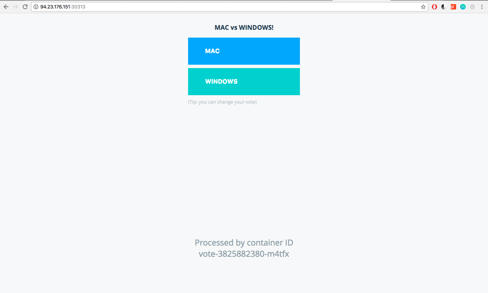
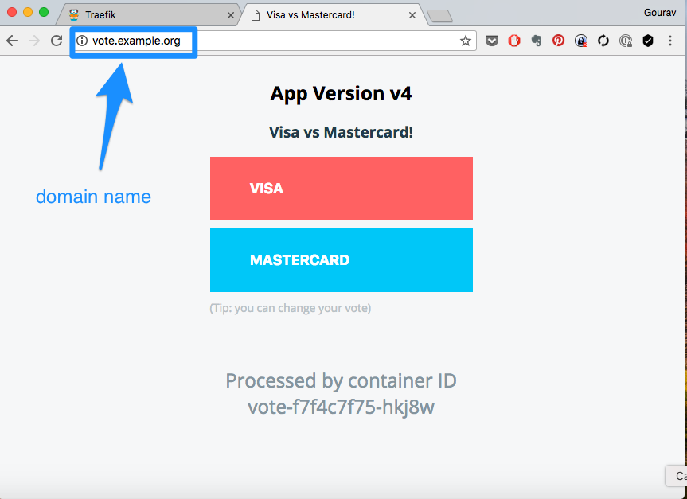

# Configurations Management with ConfigMaps and Secrets

Configmap is one of the ways to provide configurations to your application.

### Injecting env variables with configmaps
Create our configmap for vote app

file:  projects/instavote/dev/vote-cm.yaml

```
apiVersion: v1
kind: ConfigMap
metadata:
  name: vote
  namespace: instavote
data:
  OPTION_A: Visa
  OPTION_B: Mastercard
```

In the above given configmap, we define two environment variables,

  1. OPTION_A=EMACS
  2. OPTION_B=VI


Lets create the configmap object

```
kubectl get cm
kubectl apply -f vote-cm.yaml
kubectl get cm
kubectl describe cm vote


```
In order to use this configmap in the deployment, we need to reference it from the deployment file.

Check the deployment file for vote add for the following block.

file: `vote-deploy.yaml`

```
...
    spec:
      containers:
      - image: schoolofdevops/vote
        imagePullPolicy: Always
        name: vote
        envFrom:
          - configMapRef:
              name: vote
        ports:
        - containerPort: 80
          protocol: TCP
        restartPolicy: Always
```

So when you create your deployment, these configurations will be made available to your application. In this example, the values defined in the configmap (Visa and Mastercard) will override the default values(CATS and DOGS) present in your source code.

```
kubectl apply -f vote-deploy.yaml
```

Watch the monitoring screen for deployment in progress.

```
kubectl get deploy --show-labels
kubectl get rs --show-labels
kubectl  rollout status deploy/vote

```




### Note: Automatic Updation of deployments on ConfigMap  Updates

Currently, updating configMap does not ensure a new rollout of a deployment. What this means is even after updading configMaps, pods will not immediately reflect the changes.  

There is a feature request for this https://github.com/kubernetes/kubernetes/issues/22368

Currently, this can be done by using immutable configMaps.  

  * Create a configMaps and apply it with deployment.
  * To update, create a new configMaps and do not update the previous one. Treat it as immutable.
  * Update deployment spec to use the new version of the configMaps. This will ensure immediate update.


## Enabling HTTP Authentication for Traefik  with Secrets

In this part of the lab, you will

  * Create a secret with an existing file
  * Modify a ingress rule to use that secret via annotations
  * Validate if traefik, the ingress controller, automatically picks up the configurations and enables http auth s

Lets create  htpasswd spec as Secret   


```
  apt install -yq apache2-utils
  htpasswd -c auth devops
```


  Or use [Online htpasswd generator](http://www.htaccesstools.com/htpasswd-generator/) to generate a htpasswd spec. if you use the online generator, copy the contents to a file by name `auth` in the current directory.

  Then generate the secret as,

```
  kubectl create secret generic mysecret --from-file auth

  kubectl get secret

  kubectl describe secret mysecret
```

  And then add annotations to the ingress object so that it is read by the ingress controller to update configurations.

`file: vote-ing.yaml`

```
apiVersion: extensions/v1beta1
kind: Ingress
metadata:
  name: vote
  annotations:
    kubernetes.io/ingress.class: traefik
    ingress.kubernetes.io/auth-type: "basic"
    ingress.kubernetes.io/auth-secret: "mysecret"
spec:
  rules:
    - host: vote.example.com
      http:
        paths:
          - path: /
            backend:
              serviceName: vote
              servicePort: 82
    - host: results.example.com
      http:
        paths:
          - path: /
            backend:
              serviceName: results
              servicePort: 81

```

where,

  *  *ingress.kubernetes.io/auth-type: "basic"* defines authentication type that needs to be added.
  *  *ingress.kubernetes.io/auth-secret: "mysecret"* refers to the secret created earlier.

apply

```
kubectl apply -f vote-ing.yaml
kubectl get ing/vote -o yaml
```

Observe the annotations field. No sooner than you apply this spec, ingress controller reads the event and a basic http authentication is set with the secret you added.


```bash

                      +----------+
       +--update----> | traefik  |
       |              |  configs |
       |              +----------+
  +----+----+--+            ^
  | ingress    |            :
  | controller |            :
  +----+-------+            :
       |              +-----+-------+
       +---watch----> | ingress     | <------- user
                      | annotations |
                      +-------------+
```



