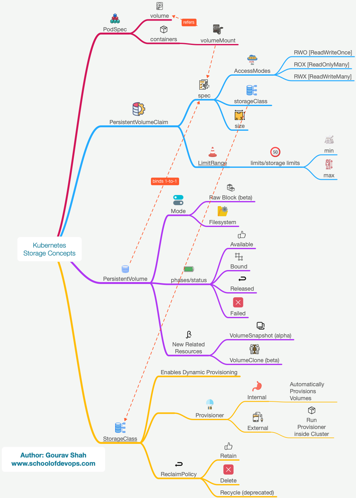

# Dynamic Storage Provisioning

This tutorial explains how kubernetes storage works and the complete workflow for the dynamic provisioning. The topics include

  * Storage Classes
  * PersistentVolumeClaim
  * persistentVolume
  * Provisioner

Pre Reading :

  * [Kubernetes Storage Concepts](https://youtu.be/hqE5c5pyfrk?t=461)
  * [Storage Classes](https://kubernetes.io/docs/concepts/storage/storage-classes/)


## Concepts



## Redploy db with a a reference to PVC

Lets begin by redeploying the db deployment, this time by configuring it to refer to the persistentVolumeClaim

`file: db-deploy-pvc.yaml`

```
...
spec:
   containers:
   - image: postgres:9.4
     imagePullPolicy: Always
     name: db
     ports:
     - containerPort: 5432
       protocol: TCP
     #mount db-vol to postgres data path
     volumeMounts:
     - name: db-vol
       mountPath: /var/lib/postgresql/data
   #create a volume with pvc
   volumes:
   - name: db-vol
     persistentVolumeClaim:
       claimName: db-pvc
```

Apply *db-deploy-pcv.yaml*  as

```
kubectl apply -f db-deploy-pvc.yaml

kubectl get pod -o wide --selector='role=db'

kubectl get pvc,pv
```

  * Observe and note which host the pod for *db* is launched.
  * What state is it in ? why?
  * Has the persistentVolumeClaim been bound to a persistentVolume ? Why?


## Creating a Persistent Volume Claim

switch to project directory

```
cd k8s-code/projects/instavote/dev/
```

Create the following file with the specs below

`file: db-pvc.yaml`

```
kind: PersistentVolumeClaim
apiVersion: v1
metadata:
  name: db-pvc
spec:
  accessModes:
    - ReadWriteOnce
  volumeMode: Filesystem
  resources:
    requests:
      storage: 2Gi
  storageClassName: nfs

```


create the Persistent Volume Claim and validate

```
kubectl get pvc


kubectl apply -f db-pvc.yaml

kubectl get pvc,pv

```

  * Is persistentVolumeClaim created ?  Why ?
  * Is persistentVolume created ?  Why ?
  * Is the persistentVolumeClaim bound with a persistentVolume ?


## Set up NFS Provisioner in kubernetes

Change into nfs provisioner installation dir

```
cd k8s-code/storage
```


Deploy nfs-client provisioner.

```
kubectl apply -f nfs

```

This will create all the objects required to setup a nfs provisioner. It would be launched with  Statefulsets. [Read the official documentation on Statefulsets](https://kubernetes.io/docs/concepts/workloads/controllers/statefulset/) to understand how its differnt than deployments.


```
kubectl get storageclass
kubectl get pods
kubectl logs -f nfs-provisioner-0

```

Now, observe the output of  the following commands,

```
kubectl get pvc,pv
kubectl get pods
```

  * Do you see pvc bound to pv ?
  * Do you see the pod for db running ?

Observe the dynamic provisioning, go to the host which is running nfs provisioner and look inside */srv* path to find the provisioned volume.

## Fix result app after recreating db

Result app which connects with the db looses the connection and ceases to work after db is redeployed. This is a bug in the application. However, to do a quick fix, redeploy result app as

```
kubectl rollout restart deploy result

```

This would recreate the pods for result app and you should see it working again.

## Nano Project

Similar to postgres which mounts the data at /var/lib/postgresql/data and consumes it to store the database files, Redis creates and stores the file at **/data** path.  Your task is to have a nfs volume of size **200Mi** created and mounted at /data for the redis container.

You could follow these steps to complete this task

  * create a pvc by name **redis**
  * create a volume in the pod spec with type persistentVolumeClaim. Call is **redis-data**
  * add volumeMounts to the container spec (part of the same deployment file) running redis and have it mount **redis-data** volume created in the pod spec above.


#### Summary

In this lab, you not only setup dynamic provisioning using NFS, but also learnt about statefulsets as well as rbac policies applied to the nfs provisioner.
